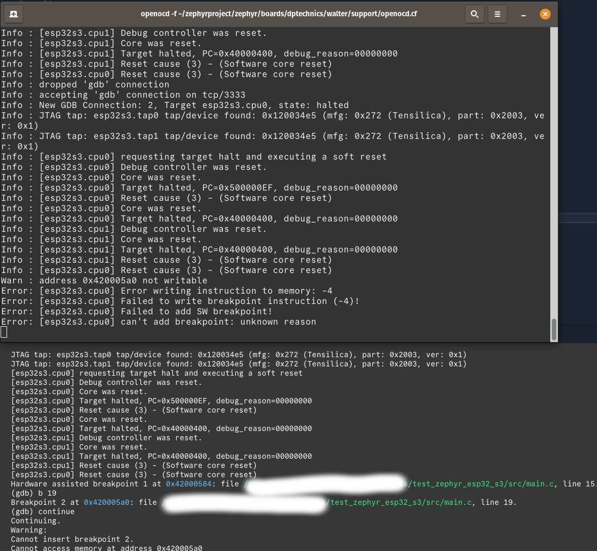

# Run

1. Run the task* `West Build`
2. Run task* `West Flash`
3. In a terminal, run the following command to launch openocd : `openocd -f ~/zephyrproject/zephyr/boards/dptechnics/walter/support/openocd.cfg`
4. Run the task* `West Debug`

(*Tasks are VSCode tasks)

# Minimal example to reproduce the bug

Add breakpoint in line 19 : 

On the "west debug" console, do: 
1. `b 19`
2. `c` (for continue)
3. see screenshot below

